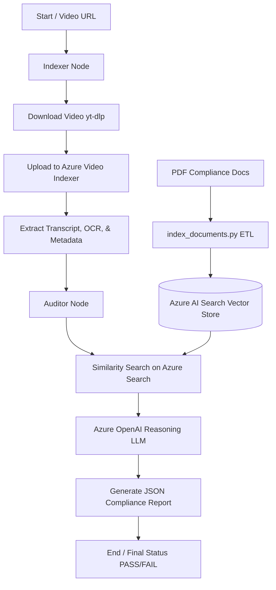

# Brand Guardian AI - Compliance QA Pipeline

Brand Guardian AI is an automated, AI-powered compliance auditing system designed to flag brand violations, regulatory non-compliance, and misleading claims in video advertisements (e.g., YouTube videos). It combines **LangGraph** orchestration, **Azure Video Indexer**, **Azure AI Search (RAG)**, **Azure OpenAI (LLMs)**, and **Azure Monitor Telemetry** to provide automated, end-to-end video compliance audits.

## 🚀 Key Features

*   **Video Ingestion & Processing**: Downloads video files automatically from YouTube via `yt-dlp` and processes them via Azure Video Indexer to extract full transcripts, on-screen text (OCR), and metadata.
*   **Regulatory Knowledge Base (RAG)**: Automatically chunks, embeds (`text-embedding-3-small`), and indexes official regulatory rulebooks (e.g., FTC Influencer Guidelines, YouTube Ad Specs) inside Azure AI Search.
*   **Intelligent Auditing (LangGraph & LLM)**: Applies LangGraph stateful DAG orchestration to retrieve matching guidelines, reason through OCR and transcripts using LLMs, and output a structured compliance report.
*   **FastAPI Web Interface**: Exposes lightweight endpoints (`/audit`, `/health`) to programmatically request video audits and query service health.
*   **Comprehensive Telemetry**: Automatically tracks and monitors performance, dependencies, and API request latency via Azure Monitor OpenTelemetry and LangSmith tracing.

---

## 🏗️ System Architecture

The pipeline follows a Directed Acyclic Graph (DAG) structured as follows:



### Flow Breakdown
1.  **Ingestion & Indexing**: The video is fetched, uploaded, and indexed by Azure Video Indexer, providing transcript and OCR texts.
2.  **Semantic Search (Retrieval)**: The system queries Azure AI Search with the transcripts and OCR content to retrieve the most relevant compliance guidelines.
3.  **Audit & Verification**: An LLM agent evaluates the transcript + OCR against the retrieved regulations to flag violations with descriptions and severity (CRITICAL, WARNING).
4.  **Reporting**: A formatted markdown summary and a structured compliance payload are generated.

---

## 📁 Folder Structure

```text
├── azure_functions/         # Placeholders for future serverless hosting
│   ├── function_app.py
│   ├── host.json
│   └── requirements.txt
├── backend/
│   ├── data/                # Regulatory PDFs (influencer guides, ad specifications)
│   ├── scripts/             # Administrative and database setup scripts
│   │   ├── index_documents.py # ETL document indexing script
│   │   └── explanation.txt  # Explanation text of indexing operations
│   └── src/
│       ├── api/             # FastAPI Server & Monitoring Instrumentation
│       │   ├── server.py    # Main API router and endpoint definitions
│       │   └── telemetry.py # Azure Application Insights setup
│       ├── graph/           # Core LangGraph execution definitions
│       │   ├── nodes.py     # Auditor and Indexer logic nodes
│       │   ├── state.py     # Schema for Graph state (VideoAuditState)
│       │   └── workflow.py  # LangGraph compilation DAG setup
│       └── services/        # Third-party integrations
│           └── video_indexer.py # Azure Video Indexer wrapper & yt-dlp service
├── main.py                  # CLI simulation runner
├── pyproject.toml           # Project dependencies managed via UV
└── README.md                # System documentation
```

---

## 🛠️ Installation & Setup

Ensure you have [Python 3.12+](https://www.python.org/downloads/) and [uv](https://github.com/astral-sh/uv) installed.

1.  **Clone the Repository**:
    ```bash
    git clone <repo-url>
    cd ComplianceQAPipeline
    ```

2.  **Install dependencies**:
    ```bash
    uv sync
    ```

3.  **Environment Variables**:
    Create a `.env` file in the root directory (based on the system configurations):
    ```ini
    # Azure Storage
    AZURE_STORAGE_CONNECTION_STRING="your-connection-string"

    # Azure OpenAI
    AZURE_OPENAI_API_KEY="your-api-key"
    AZURE_OPENAI_ENDPOINT="your-endpoint"
    AZURE_OPENAI_API_VERSION="2024-06-01"
    AZURE_OPENAI_CHAT_DEPLOYMENT="your-chat-deployment"
    AZURE_OPENAI_EMBEDDING_DEPLOYMENT="text-embedding-3-small"

    # Azure AI Search
    AZURE_SEARCH_ENDPOINT="your-search-endpoint"
    AZURE_SEARCH_API_KEY="your-search-api-key"
    AZURE_SEARCH_INDEX_NAME="your-index-name"

    # Azure Video Indexer
    AZURE_VI_NAME="your-vi-account-name"
    AZURE_VI_LOCATION="your-region"
    AZURE_VI_ACCOUNT_ID="your-vi-account-id"
    AZURE_SUBSCRIPTION_ID="your-sub-id"
    AZURE_RESOURCE_GROUP="your-rg-name"

    # Azure Application Insights Telemetry
    APPLICATIONINSIGHTS_CONNECTION_STRING="your-connection-string"

    # LangSmith Tracing
    LANGCHAIN_TRACING_V2=true
    LANGCHAIN_ENDPOINT="https://api.smith.langchain.com"
    LANGCHAIN_API_KEY="your-langchain-key"
    LANGCHAIN_PROJECT="brand-guardian-prod"
    ```

---

## 🚀 Running the Pipeline

### 1. Indexing Reference Regulatory Documents
To load the reference PDFs into Azure AI Search, run:
```bash
uv run python backend/scripts/index_documents.py
```
This loads, splits, and embeds the PDF rules into the database index.

### 2. Running a CLI Simulation Audit
To run a local simulation of the compliance audit workflow on a sample YouTube video:
```bash
uv run python main.py
```

### 3. Running the FastAPI Server
To launch the API server locally:
```bash
uv run uvicorn backend.src.api.server:app --reload
```
Once started, the API exposes the following:
*   **Swagger API Docs**: [http://localhost:8000/docs](http://localhost:8000/docs)
*   **Health Status**: `GET http://localhost:8000/health`
*   **Audit Request**: `POST http://localhost:8000/audit` with JSON payload:
    ```json
    {
      "video_url": "https://youtu.be/dT7S75eYhcQ"
    }
    ```

---

## 📊 Telemetry and Observability

All API endpoints and Azure Service calls are instrumented automatically.
*   **Azure Monitor**: Captures request traces, duration, HTTP status codes, search query latencies, and system exceptions using **OpenTelemetry**.
*   **LangSmith**: Visualizes graph node invocation chains and token consumption details.
